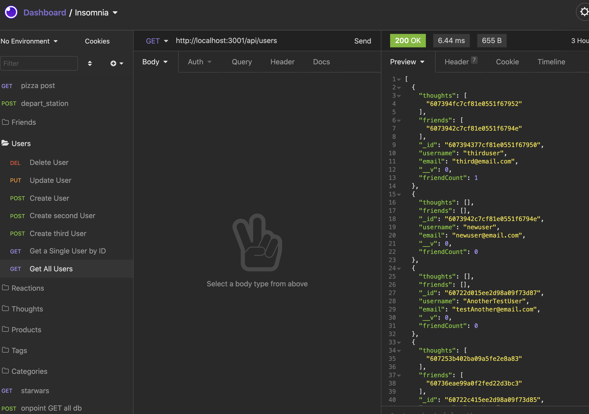

# socially-acceptable-network-apis
## by Aaron Rosenblatt

### I wrote code to build an API for a social network web application where users can share their thoughts, react to friends’ thoughts, and create a friend list. The app uses Express.js for routing, a MongoDB database, Mongoose Object Data Modeling (ODM), and the native JavaScript date obeject to format timestamps. 

### Using "npm start" at the command line starts the servers and the Mongoose models are synced to the MongoDB database. Opening the API get routes in Insomnia Core for users and thoughts will display the formatted JSON data of each route. Also, for both the user and thought routes the app user can test the API POST, PUT and DELETE routes in Insomnia Core. This will create, update and delete users and thoughts in the database. Finally, the app user can test API POST and DELETE routes in Insomnia Core to create and delete reactions to thoughts and add and remove friends from a user's friend list. 

#### To use Socially Acceptable Network APIs, clone the [app](https://github.com/noplur/socially-acceptable-network-apis/), use Terminal to go to the root directory. Type "npm start" into the command line, and open an application such as Insomnia Core. The routes can be found starting at localhost:3001/api/users and localhost:3001/api/thoughts.

### The Socially Acceptable Network APIs walk-through video can be viewed here: https://drive.google.com/file/d/1OZNo5iBd-U5S6t-v2kD-qVBXN29MfuYg/view

### The GitHub repository for the Socially Acceptable Network APIs can be viewed here: https://github.com/noplur/socially-acceptable-network-apis/

### Here is a screenshot of a sample from Socially Acceptable Network APIs:
### 